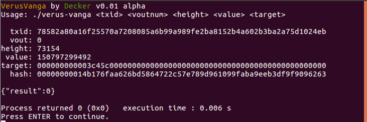
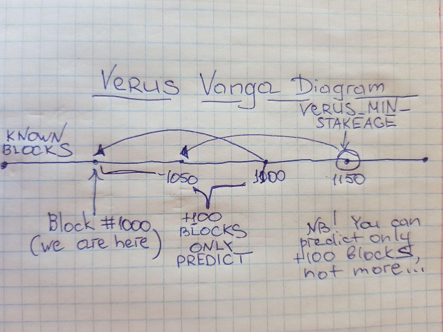

### What's this?

This is funny tool for VRSC that allows you to know is this a winner between your UTXOs for **next 100** blocks or no.

Don't forget that `VERUS_MIN_STAKEAGE` = 150 and knowledge about next +100 blocks gives you nothing. Because you can't manipulate txid ... for example, if now nHeight = 1000 (current we are solving block 1000) we can predict winner for [1000..1100] block, but not far. And if you make a tx on 1000 blocks, it starts staking only on 1150 block and there is no prediction for this utxo. Only for next +100 blocks for utxo with depth > 150 (depth = number of confirmations).

**Usage example:**

	Usage: ./verus-vanga <txid> <voutnum> <height> <value> <target>
	
Real example:

	./bin/Release/verus_vanga 78582a80a16f25570a7208085a6b99a989fe2ba8152b4a602b3ba2a75d1024eb 0 73195 150797299492 000000000004f3dc000000000000000000000000000000000000000000000000
	
Here:
`txid` - txid id of utxo
`voutnum` - num of this vout 
`height` - height of block on which we want to predict (+0 ... +100 of current height)
`value` - utxo value
`target` - pos target (you can't acquire this 256-bit via RPC, it calcs internally in verusd).

But you can add debug printout to source code in `wallet.cpp` to know this number:

	    pwalletMain->AvailableCoins(vecOutputs, true, NULL, false, false);

    if (pastBlockIndex = komodo_chainactive(nHeight - COINBASE_MATURITY))
    {
        uint256 pastHash = pastBlockIndex->GetBlockHash();

        BOOST_FOREACH(COutput &txout, vecOutputs)
        {
        
            // [+] Decker 
            printf("[ %d.%s.%d ] %s %s\n", nHeight, txout.tx->GetHash().ToString().c_str(), txout.i, txout.tx->GetVerusPOSHash(txout.i, nHeight, pastHash).ToString().substr(0,16).c_str(), target.ToString().substr(0,16).c_str());
            // [+] Decker
            
            if (txout.fSpendable && (UintToArith256(txout.tx->GetVerusPOSHash(txout.i, nHeight, pastHash)) <= target) && (txout.nDepth >= VERUS_MIN_STAKEAGE))
            {
                // get the smallest winner
                if (Solver(txout.tx->vout[txout.i].scriptPubKey, whichType, vSolutions) && (whichType == TX_PUBKEY || whichType == TX_PUBKEYHASH) &&
                    (!pwinner || pwinner->tx->vout[pwinner->i].nValue > txout.tx->vout[txout.i].nValue))
                    pwinner = &txout;
            }
        }

### Screens

 

 

### How to use?

Combine using this tool with bash scripting and parsing json output of daemon. For example you can obtain all of your utxos in format utxo:vout:value and try to make a prediction.

See `predict.sh` example script in repo.
